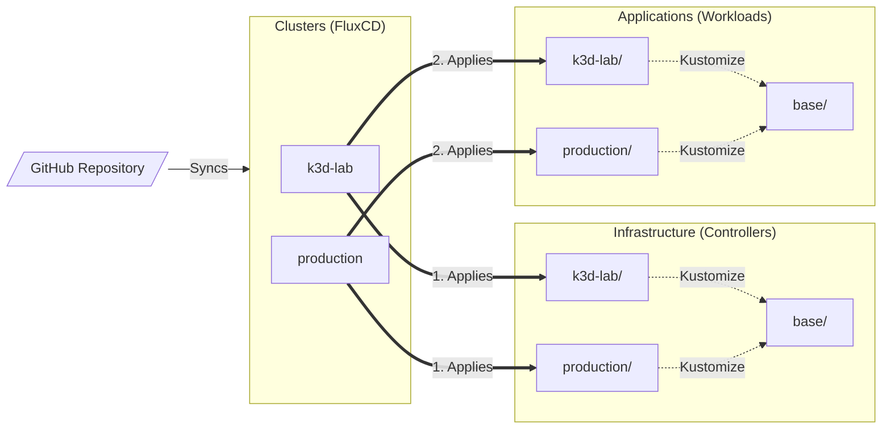
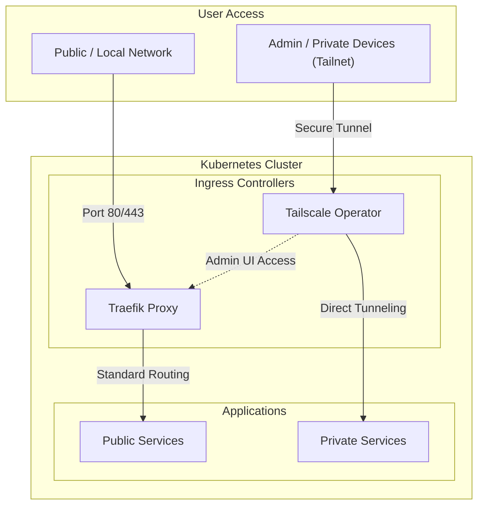

# fleet-infra

GitOps homelab infrastructure managed by [Flux CD](https://fluxcd.io).

## Architecture & GitOps Flow

This repository follows the Base/Overlay pattern to manage multiple environments while reusing common configurations.



## Hybrid access strategy

We use a dual-layer security model to balance accessibility and high-level protection.



The two pillars:

1. Public/Local Path (Traefik Proxy): Standard access for shared services. Traefik acts as the front-door for all non-sensitive traffic.

2. Private Path (Tailscale): Zero Trust access for sensitive services and infrastructure management. For security reasons, the Traefik Proxy Dashboard (the admin interface) is not exposed publicly. It is strictly routed through a Tailscale tunnel, separating the "worker" (traffic routing) from the "manager" (UI dashboard).

## Quickstart (Local Dev)

We use [`k3d`](https://k3d.io) for local development, disabling default k3s components to let Flux manage the stack.

### 1. Create the Cluster

```bash
k3d cluster create fleet-infra \
  --image rancher/k3s:v1.31.1-k3s1 \
  --k3s-arg "--disable=traefik@server:0" \
  --k3s-arg "--disable=servicelb@server:0" \
  --k3s-arg "--disable=local-storage@server:0" \
  -p "80:80@loadbalancer" \
  -p "443:443@loadbalancer" \
  --agents 2
```

### 2. Inject Secrets Decryption Key

Flux needs your Age key to decrypt SOPS-encrypted secrets. Place your `age.agekey` file at the root of the project and run:

```bash
kubectl create namespace flux-system
kubectl create secret generic sops-age \
  --namespace=flux-system \
  --from-file=age.agekey=age.agekey
```

### 3. Bootstrap Flux

Export your GitHub credentials and link the cluster to this repository:

```bash
export GITHUB_USER="<your-github-username>"
export GITHUB_TOKEN="<your-personal-access-token>"

flux bootstrap github \
  --owner=$GITHUB_USER \
  --repository=fleet-infra \
  --branch=main \
  --path=clusters/k3d-lab \
  --personal
```

### 4. Verify Deployment

Watch the GitOps synchronization progress:

```bash
flux get kustomizations --watch
```

Once all Kustomizations are `Ready: True`, your cluster is fully operational! Check your pods with `kubectl get pods -A`.
